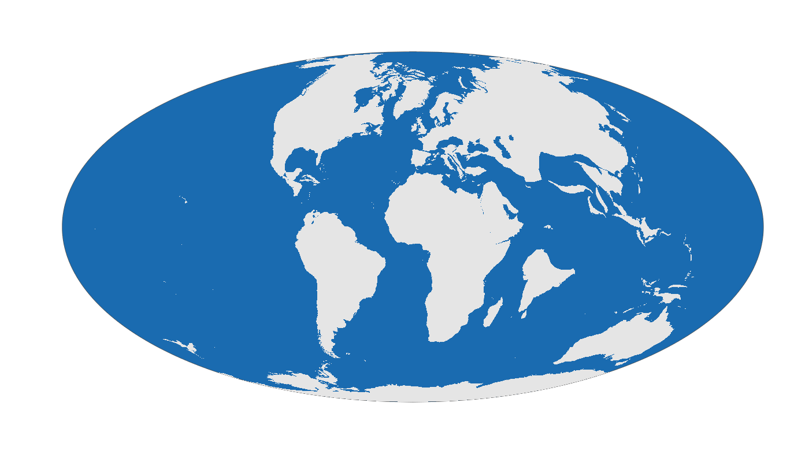

```{r setup, include=FALSE}
knitr::opts_chunk$set(echo = TRUE)

library(badger)
```

# rgplates 

`r badge_devel("adamkocsis/rgplates", "green")`
`r badge_cran_release("rgplates", "blue")`
`r badge_cran_download("rgplates", "grand-total", "yellow")`
`r badge_cran_checks("rgplates")`

#### R interface for the *GPlates Web Service* and the *GPlates Application*
<br>

## About
* * *

Functions to the [GPlates Web Service](https://gws.gplates.org/) and the [GPlates Desktop Application](https://www.gplates.org/) allow users to reconstruct past positions of geographic entities based on user-selected rotation models without leaving the R running environment. 

The **online reconstruction** (with the [GPlates Web Service](https://gws.gplates.org/)) makes the rotation of static plates, coastlines, and a low number of geographic coordinates available using nothing but an internet connection. 

The **offline reconstruction** requires an external installation of the GPlates Desktop Application, but allows the efficient batch rotation of thousands of coordinates, Simple Features ([`sf`](https://cran.r-project.org/package=sf)) and Spatial ([`sp`](https://cran.r-project.org/package=sp)) objects with custom reconstruction trees and partitioning polygons. Examples of such plate tectonic models are accessible via the [chronosphere-portal](http://www.chronosphere-portal.org/). 


## Example
* * *

You can reconstruct the positions of the plates at 65 Ma using the [PaleoMAP model](https://www.earthbyte.org/paleomap-paleoatlas-for-gplates/) and transform them to [Mollweide](https://epsg.io/54009) projection using with this chunk of code: 

```{r intro_run, include=FALSE}
library(rgplates)

# Rotation of plates using the GPlates Web Service
plates <- reconstruct("plates", age=65, model="PALEOMAP")

# the edge of the map (for mollweide)
edge <- mapedge()

# transform to Mollweide
epsg <- "ESRI:54009"
platesMoll <- sf::st_transform(plates, crs=epsg)
edgeMoll <- sf::st_transform(edge, crs=epsg)

png("man/figures/rgplates_example.png", width=1400,height=800)
	# plot
	plot(edgeMoll, col="#1A6BB0", border="gray30")
	plot(platesMoll, border=NA, col="gray90", add=TRUE)
dev.off()

```


```{r intro, eval=FALSE}
library(rgplates)

# Rotation of plates using the GPlates Web Service
plates <- reconstruct("plates", age=65, model="PALEOMAP")

# the edge of the map (for mollweide)
edge <- mapedge()

# transform to Mollweide
epsg <- "ESRI:54009"
platesMoll <- sf::st_transform(plates, crs=epsg)
edgeMoll <- sf::st_transform(edge, crs=epsg)

# plot
plot(edgeMoll, col="#1A6BB0", border="gray30")
plot(platesMoll, border=NA, col="gray90", add=TRUE)
```





<br>

## Notes 
* * *

#### History

The functions here were originally developed and published as part of the [chronosphere](https://cran.r-project.org/package=chronosphere) R package. For better compliance with [UNIX philosophy](https://en.wikipedia.org/wiki/Unix_philosophy) and more efficient distribution/development, the original chronosphere has been broken up to three R packages:

- [`rgplates`](https://adamkocsis.github.io/rgplates/): functions related to tectonic reconstructions.
- [`via`](https://adamkocsis.github.io/via/): Virtual Arrays for efficient organisation of high-dimensional data.
- `chronosphere`: version-controlled data distribution.

This is a beta version, and like R, comes with absolutely no warranty.

#### Aim

The package was developed to make R-based analyses that require paloecoordinate rotations easier to implement, i.e. for applying a rotation model - but not as a replacement of tools dedidacted to complex paleogeographic reconstruction and model development. For more complex analyses you are more than welcome to check out [pyGPlates](https://www.gplates.org/docs/pygplates/), the awesome python module developed by the GPlates team.


