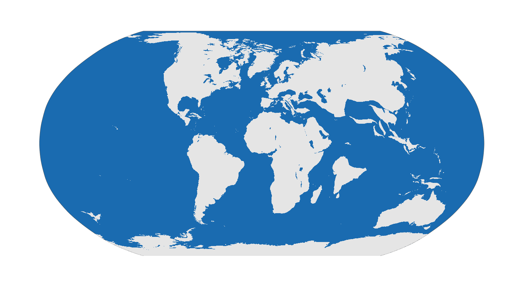

# rgplates 

[](https://github.com/adamkocsis/rgplates)
[](https://cran.r-project.org/package=rgplates)
[](https://cran.r-project.org/package=rgplates)
[](https://cran.r-project.org/web/checks/check_results_rgplates.html)

#### R interface for the *GPlates Web Service* and the *GPlates Application*

<br>

## About

-----

Functions to the [GPlates Web Service](https://gws.gplates.org/) and the
[GPlates Desktop Application](https://www.gplates.org/) allow users to
reconstruct past positions of geographic entities based on user-selected
rotation models without leaving the R running environment.

The **online reconstruction** (with the [GPlates Web
Service](https://gws.gplates.org/)) makes the rotation of static plates,
coastlines, and a low number of geographic coordinates available using
nothing but an internet connection.

The **offline reconstruction** requires an external installation of the
GPlates Desktop Application, but allows the efficient batch rotation of
thousands of coordinates, Simple Features
([`sf`](https://cran.r-project.org/package=sf)) and Spatial
([`sp`](https://cran.r-project.org/package=sp)) objects with custom
reconstruction trees and partitioning polygons. Examples of such plate
tectonic models are accessible via the
[chronosphere](http://www.chronosphere.info/).

## Example

-----

You can reconstruct the positions of the plates at 65 Ma using the
[Merdith et al. 2021
model](https://www.sciencedirect.com/science/article/pii/S0012825220305237)
and transform them to [Mollweide](https://epsg.io/54009) projection
using with this chunk of code:

``` r
library(rgplates)

# Rotation of plates using the GPlates Web Service
coastlines <- reconstruct("coastlines", age=65, model="MERDITH2021")

# the edge of the map (for mollweide)
edge <- mapedge()

# transform to Mollweide
epsg <- "ESRI:54009"
coastsMoll <- sf::st_transform(coastlines, crs=epsg)
edgeMoll <- sf::st_transform(edge, crs=epsg)

# plot
plot(edgeMoll, col="#1A6BB0", border="gray30")
plot(coastsMoll, border=NA, col="gray90", add=TRUE)
```



<br>

## Notes

-----

#### History

The functions here were originally developed and published as part of
the [chronosphere](https://chronosphere.info/r_client/) R package. For
better compliance with [UNIX
philosophy](https://en.wikipedia.org/wiki/Unix_philosophy) and more
efficient distribution/development, the original chronosphere has been
broken up to three R packages:

  - [`chronosphere`](https://chronosphere.info/r_client/):
    version-controlled data distribution.
  - [`rgplates`](https://adamkocsis.github.io/rgplates/): functions
    related to tectonic reconstructions.
  - [`via`](https://adamkocsis.github.io/via/): Virtual Arrays for
    efficient organisation of high-dimensional data.

This is a beta version, and like R, comes with absolutely no warranty.

#### Aim

The package was developed to make R-based analyses that require
paloecoordinate rotations easier to implement, i.e. for applying a
rotation model - but not as a replacement of tools dedidacted to complex
paleogeographic reconstruction and model development. For more complex
analyses you are more than welcome to check out
[gplately](https://gplates.github.io/gplately/) and
[pyGPlates](https://www.gplates.org/docs/pygplates/), the awesome python
packages developed by the GPlates team.
